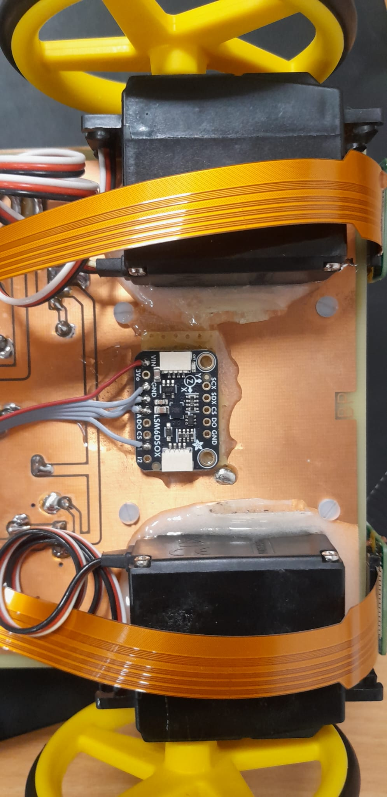

# LSM6DSOX for Raspberry Pi 5
Event driven C++ implementation of real-time data from an LSM6DSOX IMU.

The photo shows it mounted underneath the Zetabot between its wheels:


## Requirements

Raspberry Pi 5 with Debian Trixie OS, gpiod library version 2

```
sudo apt-get install libgpiod cmake libgtest-dev libi2c-dev
```

## Connect Pi 5 to LSM6DSOX

* GPIO17 (physical pin 11 on Pi) ->I1 (data ready pin 1)
* 3V (physical pin 1 on Pi) -> VDD
* GND -> GND
* SDA (physical pin 3) -> SDA
* SCL (physical pin 5) -> SCL

## Compile
```
cmake .
make
```

The install the library type:

```
sudo make install
```

## Test

Run the unit tests with. It also reads read data from the chip so make sure it's
connected and I2C is enabled:

```
ctest
```

## Example

Go to `demo`. There is `sample_printer` which prints the acceleration and gyro data on the screen till you press enter.

## Troubleshooting

Check if you see the I2C device address.

Install the i2c tools:
```
sudo apt install i2c-tools
```

Detect it:
```
i2cdetect -y 1
```
You should see the address `6a`:

```
i2cdetect -y 1
     0  1  2  3  4  5  6  7  8  9  a  b  c  d  e  f
00:                         -- -- -- -- -- -- -- -- 
10: -- -- -- -- -- -- -- -- -- -- -- -- -- -- -- -- 
20: -- -- -- -- -- -- -- -- -- -- -- -- -- -- -- -- 
30: -- -- -- -- -- -- -- -- -- -- -- -- -- -- -- -- 
40: -- -- -- -- -- -- -- -- -- -- -- -- -- -- -- -- 
50: -- -- -- -- -- -- -- -- -- -- -- -- -- -- -- -- 
60: -- -- -- -- -- -- -- -- -- -- 6a -- -- -- -- -- 
70: -- -- -- -- -- -- -- --                         
```

## Credit

 - Giulia Lafratta
 - Bernd Porr
